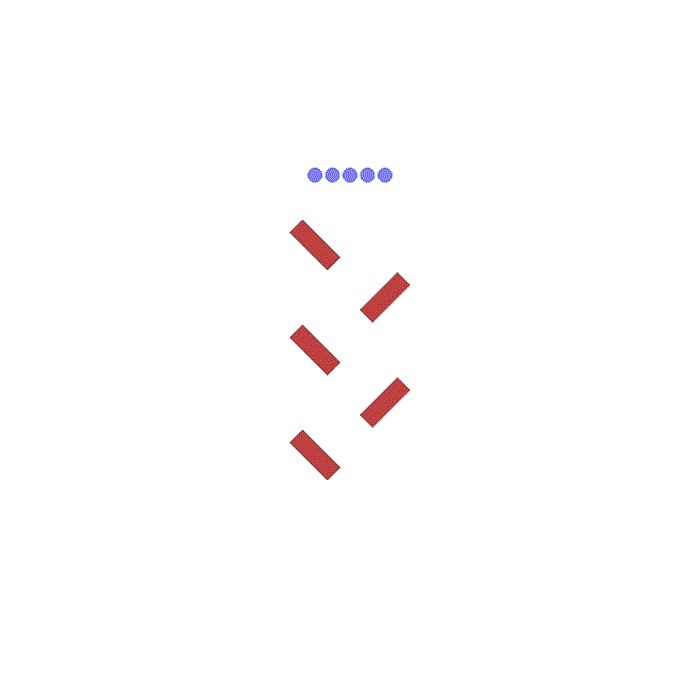
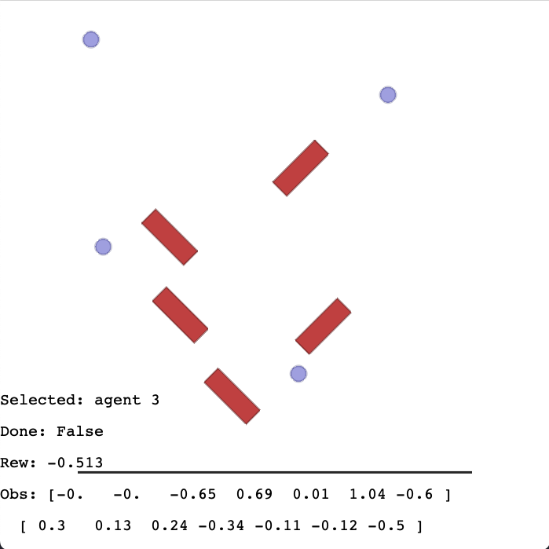
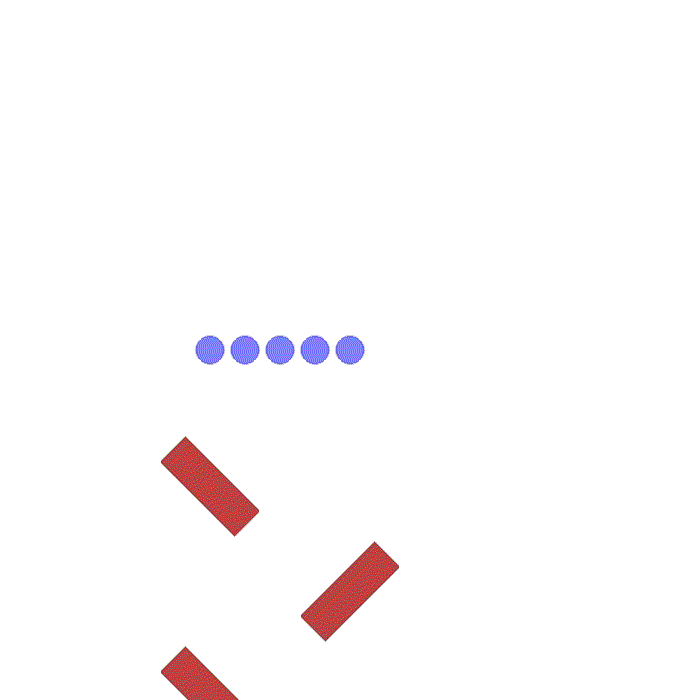
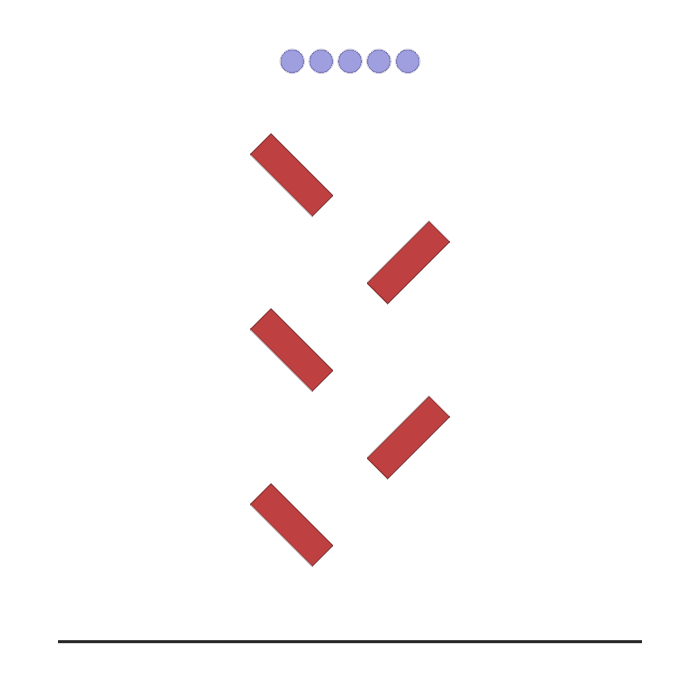
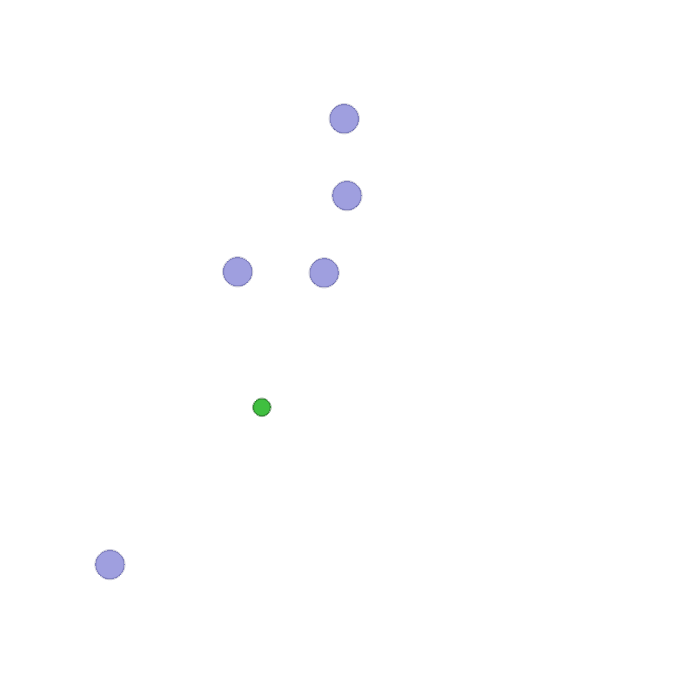
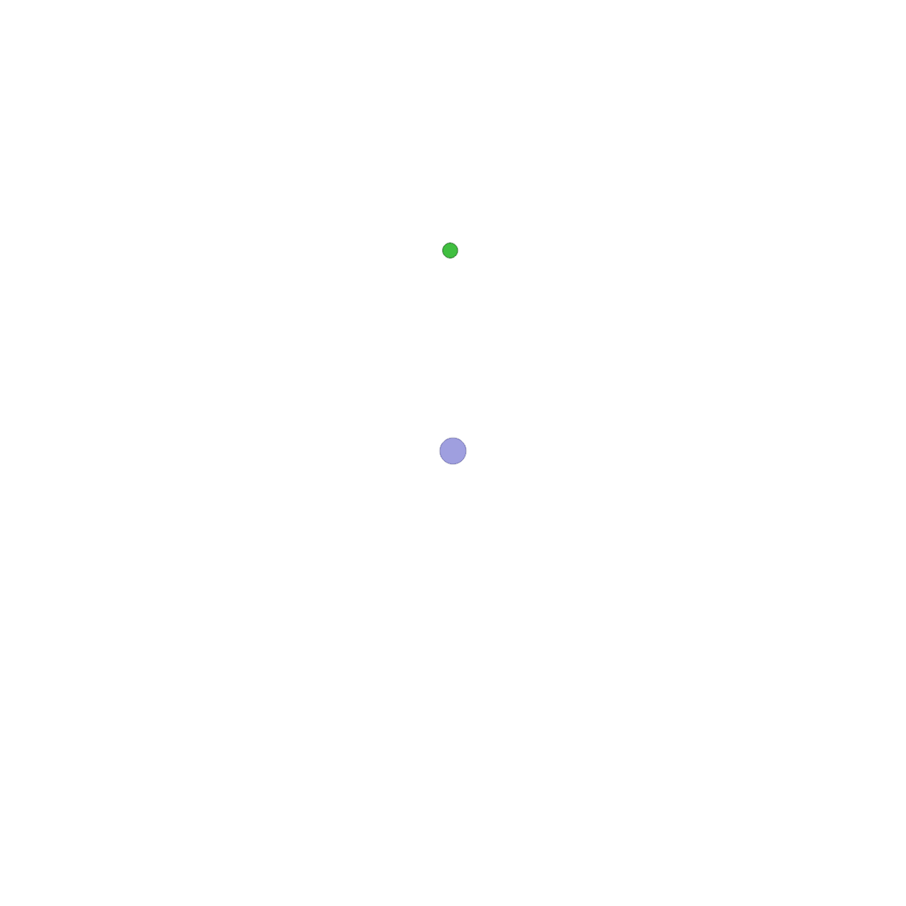
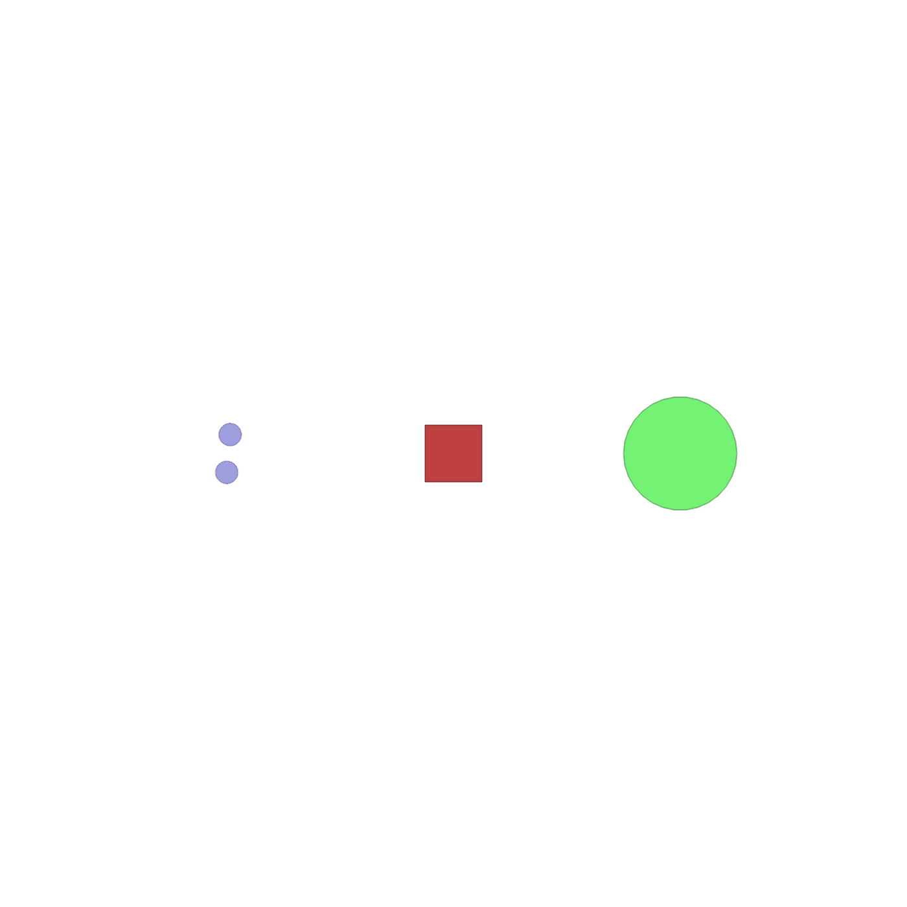
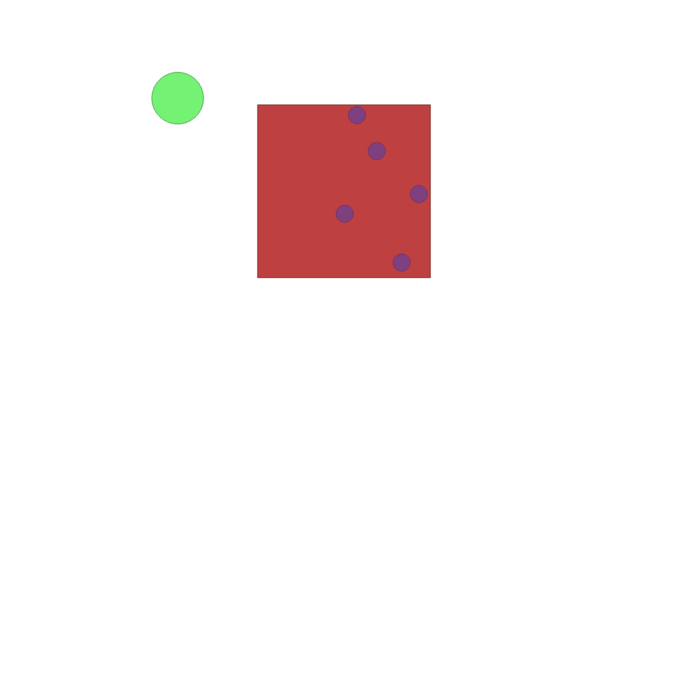
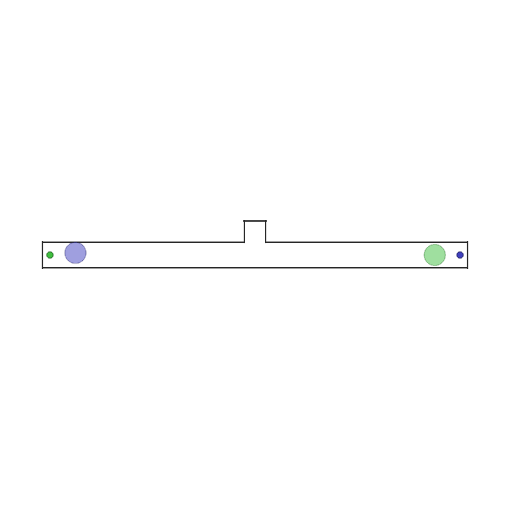

# MultiAgentParticleSimulator (MAPS)
 
Welcome to **MAPS**!

This repository contains the code for the Multi Agent Particle Simulator (MAPS).

  

MAPS is a vectorized simulator designed for simulating agents and entities in a 2D particle world.
Its primary use is Multi Agent Reinforcement Learning (MARL) as it provides OpenAI gym interfaces
for all scenarios. It simulates basic body dynamics and elastic collisions. The implementation 
is written in PyTorch to provide environment vectorization (multiple environments can be stepped parallely 
in a batch). The implementation is based on [OpenAI's MPE](https://github.com/openai/multiagent-particle-envs). 
We support all the scenarios in MPE. Additionally, we created new MARL robotics benchmarking scenarios.
With respect to MPE, we also introduced environment vectorization and new simulator features like
additional shapes for entities (boxes, lines) and related collision rules.

## How to use

### Notebook &ensp; [](https://colab.research.google.com/drive/1ipcNWJH0LKv6eLNs05tPrcLQHisbFaFU?usp=sharing)
Here is a simple notebook that you can run to create, step and render any environment. It reproduces the `use_maps_env.py` script in the `examples` folder.

### Install

To install the simulator, simply install the requirements using:
```
pip install -r requirements.txt
```
rllib dependencies are outdated, so then run:
```
pip install gym==0.22
```
and then install the package with:
```
pip install -e .
```

### Run 

To use the simulator, simply create an environment by passing the name of the scenario
you want (from the `scenarios` folder) to the `make_env` function.
The function arguments are explained in the documentation. The function returns an environment
object with the OpenAI gym interface:

Here is an example:
```
 env = make_env(
        scenario_name="simple",
        num_envs=32,
        device="cuda",
        continuous_actions=True,
        rllib_wrapped=False,
        **kwargs # Additional arguments you want to pass to the scenario initialization
    )
```
A further example that you can run is available in the `examples` directory.

## Simulator features

- **Vectorization**: the simulator is vectorized and uses torch tensor operations to step environments parallely
- **Rllib compatible**: A wrapper is already available in `environment` to use the scenarios in [rllib](https://docs.ray.io/en/latest/rllib/index.html) as a rllib.VectorEnv object.
Keep in mind that this interface is less efficient than the unwrapped version. For an example of wrapping, see the main of `make_env`.
- **Entity shapes**: Our entities (agent and landmarks) can have different customizable shapes (spheres, boxes, lines).
These shapes are supported for elastic collisions. For details on which collidable pairs are supported look at the `core`.
- **Faster than physics engines**: Our simulator is extremely lightweight, using only tensor operations. It is perfect for 
running MARL training at scale with multi-agent collisions and interactions.
- **Customizable**: When creating a new scenario of your own, the world, agent and landmarks are highly
customizable. Examples are: _world damping, simulation timestep, non-differentiable communication, agent sensors, masses and densities_.
- **Easy to extend**: You can define your own scenario in minutes. Have a look at the dedicated section in this document.
- **Non-differentiable communication**: Scenarios can require agents to perform discrete or continuous communication actions.

## Creating a new scenario

To create a new scenario, just extend the `BaseScenario` class in `scenario`.

You will need to implement at least `make_world`, `reset_world_at`, `observation`, and `reward`. Optionally, you can also implement `done` and `info`.

To know how, just read the documentation of `BaseScenario` and look at the implemented scenarios. 

## Play a scenario

You can play with a scenario interactively!

Just use the `render_interactively` script. Relevant values will be plotted to screen.
Move the agent with the arrow keys and switch agents with TAB. You can reset the environment by pressing R

Here is an overview of what it looks like:

<p align="center">

</p>

## Rendering

To render the environment, just call the `render` or the `try_render_at` functions (depending on environment wrapping).

Example:
```
env.render(
    mode="rgb_array", # Rgb array returns image, "human" renders in display
    agent_index_focus=4, # If None keep all agents in camera, else focus camera on specific agent
    index=0 # Index of batched environment to render
)
```

|                                    Gif                                     |                             Agent focus                             |
|:--------------------------------------------------------------------------:|:-------------------------------------------------------------------:|
|                | With ` agent_index_focus=None` the camera keeps focus on all agents |
|  |       With ` agent_index_focus=0` the camera follows agent 0        |
|  |       With ` agent_index_focus=4` the camera follows agent 4        |

### Rendering on server machines
To render in machines without a display use `mode=rgb_array`. Make sure you have OpenGL and Pyglet installed.
To enable rendering on headless machines you should install EGL.
If you do not have EGL, you need to create a fake screen. You can do this by running these commands before the script: 
```
export DISPLAY=':99.0'
Xvfb :99 -screen 0 1400x900x24 > /dev/null 2>&1 &
```
or in this way:
```
xvfb-run -s \"-screen 0 1400x900x24\" python <your_script.py>
```
To create a fake screen you need to have `Xvfb` installed.

## List of environments
### MAPS
| Env name               | Description                                                                                                                                                                                                                                                                                                                                                                                                                                                                                                                                                                                                                                                                                                                                                                                                                                                                                                                                                          | GIF                                                                           |
|------------------------|----------------------------------------------------------------------------------------------------------------------------------------------------------------------------------------------------------------------------------------------------------------------------------------------------------------------------------------------------------------------------------------------------------------------------------------------------------------------------------------------------------------------------------------------------------------------------------------------------------------------------------------------------------------------------------------------------------------------------------------------------------------------------------------------------------------------------------------------------------------------------------------------------------------------------------------------------------------------|-------------------------------------------------------------------------------|
| `waterfall.py`         | Debug environment. `n_agents` agents are spawned in the top of the environment. Each agent is rewarded based on how close it is to the center of black line at the bottom. Agents have to reach the line and in doing so they might collide with each other and with boxes in the environment.                                                                                                                                                                                                                                                                                                                                                                                                                                                                                                                                                                                                                                                                       |          |
| `dropout.py`           | In this scenario `n_agents` and a goal are spawned at random positions between -1 and 1. Agents cannot collide with each other and with the goal. The reward is shared among all agents. The team receives a reward of 1 when at least one agent reaches the goal. A penalty is given to the team proportional to the sum of the magnitude of actions of every agent. This penalises agents for moving. The impact of the energy reward can be tuned by setting `energy_coeff`. The default coefficient is 0.02 makes it so that for one agent it is always worth reaching the goal. The optimal policy consists in agents sending only the closest agent to the goal and thus saving as much energy as possible. Every agent observes its position, velocity, relative position to the goal and a flag that is set when someone reaches the goal. The environment terminates when when someone reaches the goal. To solve this environment communication is needed. |            |
| `disperion.py`         | In this scenario `n_agents` agents and goals are spawned. All agents spawn in [0,0] and goals spawn at random positions between -1 and 1.   Agents cannot collide with each other and with the goals. Agents are tasked with reaching the goals. When a goal is reached, the team gets a reward of 1 if `share_reward` is true, otherwise the agents which reach that goal in the same step split the reward of 1. If `penalise_by_time` is true, every agent gets an additional reward of -0.01 at each step. The optimal policy is for agents to disperse and each tackle a different goal. This requires high coordination and diversity. Every agent observes its position and velocity. For every goal it also observes the relative position and a flag indicating if the goal has been already reached by someone or not. The environment terminates when all the goals are reached.                                                                          |         | 
| `transport.py`         | In this scenario `n_agents`, `n_packages` (default 1) and a goal are spawned at random positions between -1 and 1. Packages are boxes with `package_mass` mass (default 50 times agent mass) and `package_width` and `package_length` as sizes.  The goal is for agents to push all packages to the goal. When all packages overlap with the goal, the scenario ends. Each agent receives the same reward which is the sum of the negative distances between each package and the goal. Once a package overlaps with the goal, it becomes green and its contribution to the reward becomes 0. Each agent observes its position, velocity, relative position to packages and relative position between packages and the goal. By default packages are very heavy and one agent is barely able to push them. Agents need to collaborate and push packages together to be able to move them faster.                                                                     |          |
| `reverse_transport.py` |                                                                                                                                                                                                                                                                                                                                                                                                                                                                                                                                                                                                                                                                                                                                                                                                                                                                                                                                                                      |  |
| `give_way.py`          | In this scenario two agents and two goals are spawned in a narrow corridor. The agents need to reach the goal with their color. The agents are standing in front of each other's goal and thus need to swap places. In the middle of the corridor there is an asymmetric opening which fits one agent only. Therefore the optimal policy is for one agent to give way to the other. This requires heterogenous behaviour. If `shared_reward` is true, each agent gets a reward of one when someone reaches a goal, otherwise each agent gets a reward of 1 for reaching its goal. Each agent observes its position, velocity and the relative position to its goal. The scenario terminates when both agents reach their goals.                                                                                                                                                                                                                                      |           |
| `give_way.py`          |                                                                                                                                                                                                                                                                                                                                                                                                                                                                                                                                                                                                                                                                                                                                                                                                                                                                                                                                                                      |                                                                               |  
| `balance.py`           |                                                                                                                                                                                                                                                                                                                                                                                                                                                                                                                                                                                                                                                                                                                                                                                                                                                                                                                                                                      |                                                                               |  
| `passage.py`           |                                                                                                                                                                                                                                                                                                                                                                                                                                                                                                                                                                                                                                                                                                                                                                                                                                                                                                                                                                      |                                                                               | 
| `football.py`          |                                                                                                                                                                                                                                                                                                                                                                                                                                                                                                                                                                                                                                                                                                                                                                                                                                                                                                                                                                      |                                                                               | 


|                                                                                                 **<p align="center">waterfall</p>** <br/>  <br/> **<p align="center">waterfall</p>** <br/>                                                                               |     **<p align="center">waterfall</p>** <br/>  <br/> **<p align="center">waterfall</p>** <br/>                                                                                 |               **<p align="center">waterfall</p>** <br/>  <br/> **<p align="center">waterfall</p>** <br/>                                                                       |  
|-------------------------------------------------------------------------------------------------------------------------------------------------------------------------------|-------------------------------------------------------------------------------------|-------------------------------------------------------------------------------------|
| **<p align="center">waterfall</p>** <br/>  <br/> **<p align="center">waterfall</p>** <br/>  | **<p align="center">waterfall</p>** <br/>  | **<p align="center">waterfall</p>** <br/>  |
| **<p align="center">waterfall</p>** <br/>                                                                                            | **<p align="center">waterfall</p>** <br/>  | **<p align="center">waterfall</p>** <br/>  |     
|                                                                                                                                                                               |                                                                                     |                                                                                     |     


### [MPE](https://github.com/openai/multiagent-particle-envs)

| Env name in code (name in paper)                         | Communication? | Competitive? | Notes                                                                                                                                                                                                                                                                                                                                                                                                                                                                                                                                                             |
|----------------------------------------------------------|----------------|--------------|-------------------------------------------------------------------------------------------------------------------------------------------------------------------------------------------------------------------------------------------------------------------------------------------------------------------------------------------------------------------------------------------------------------------------------------------------------------------------------------------------------------------------------------------------------------------|
| `simple.py`                                              | N              | N            | Single agent sees landmark position, rewarded based on how close it gets to landmark. Not a multiagent environment -- used for debugging policies.                                                                                                                                                                                                                                                                                                                                                                                                                |
| `simple_adversary.py` (Physical deception)               | N              | Y            | 1 adversary (red), N good agents (green), N landmarks (usually N=2). All agents observe position of landmarks and other agents. One landmark is the ‘target landmark’ (colored green). Good agents rewarded based on how close one of them is to the target landmark, but negatively rewarded if the adversary is close to target landmark. Adversary is rewarded based on how close it is to the target, but it doesn’t know which landmark is the target landmark. So good agents have to learn to ‘split up’ and cover all landmarks to deceive the adversary. |
| `simple_crypto.py` (Covert communication)                | Y              | Y            | Two good agents (alice and bob), one adversary (eve). Alice must sent a private message to bob over a public channel. Alice and bob are rewarded based on how well bob reconstructs the message, but negatively rewarded if eve can reconstruct the message. Alice and bob have a private key (randomly generated at beginning of each episode), which they must learn to use to encrypt the message.                                                                                                                                                             |
| `simple_push.py` (Keep-away)                             | N              | Y            | 1 agent, 1 adversary, 1 landmark. Agent is rewarded based on distance to landmark. Adversary is rewarded if it is close to the landmark, and if the agent is far from the landmark. So the adversary learns to push agent away from the landmark.                                                                                                                                                                                                                                                                                                                 |
| `simple_reference.py`                                    | Y              | N            | 2 agents, 3 landmarks of different colors. Each agent wants to get to their target landmark, which is known only by other agent. Reward is collective. So agents have to learn to communicate the goal of the other agent, and navigate to their landmark. This is the same as the simple_speaker_listener scenario where both agents are simultaneous speakers and listeners.                                                                                                                                                                                    |
| `simple_speaker_listener.py` (Cooperative communication) | Y              | N            | Same as simple_reference, except one agent is the ‘speaker’ (gray) that does not move (observes goal of other agent), and other agent is the listener (cannot speak, but must navigate to correct landmark).                                                                                                                                                                                                                                                                                                                                                      |
| `simple_spread.py` (Cooperative navigation)              | N              | N            | N agents, N landmarks. Agents are rewarded based on how far any agent is from each landmark. Agents are penalized if they collide with other agents. So, agents have to learn to cover all the landmarks while avoiding collisions.                                                                                                                                                                                                                                                                                                                               |
| `simple_tag.py` (Predator-prey)                          | N              | Y            | Predator-prey environment. Good agents (green) are faster and want to avoid being hit by adversaries (red). Adversaries are slower and want to hit good agents. Obstacles (large black circles) block the way.                                                                                                                                                                                                                                                                                                                                                    |
| `simple_world_comm.py`                                   | Y              | Y            | Environment seen in the video accompanying the paper. Same as simple_tag, except (1) there is food (small blue balls) that the good agents are rewarded for being near, (2) we now have ‘forests’ that hide agents inside from being seen from outside; (3) there is a ‘leader adversary” that can see the agents at all times, and can communicate with the other adversaries to help coordinate the chase.                                                                                                                                                      |

## TODOS

- [ ] Implement resampling of random position until valid
- [ ] Implement LIDAR and other sensors (camera)
- [ ] Move simulation core from force-based to impulse-based
- [ ] Vectorization in the agents (improve collision loop)
- [X] Rewrite all MPE scenarios
  - [X] simple
  - [x] simple_adversary
  - [X] simple_crypto
  - [X] simple_push
  - [X] simple_reference
  - [X] simple_speaker_listener
  - [X] simple_spread
  - [X] simple_tag
  - [X] simple_world_comm
